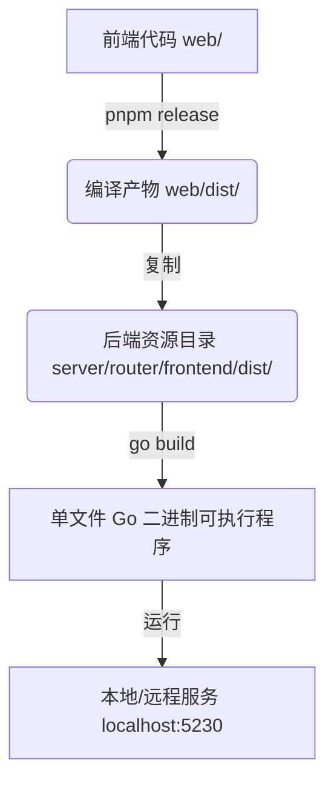
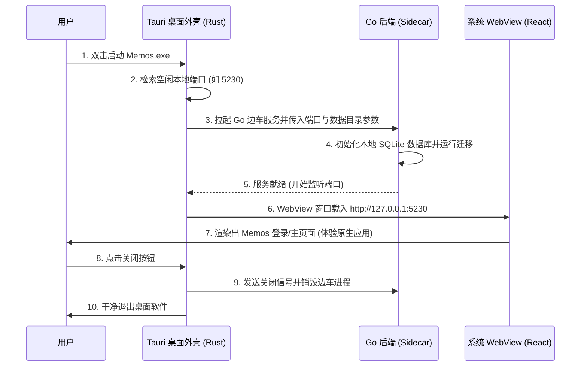

# Memos 项目改善调查分析报告

本项目调查分析报告旨在评估将开源轻量级笔记项目 [Memos](https://github.com/usememos/memos.git) 改造为桌面端软件（客户端）以及添加自定义功能（如音乐播放器等）的可行性、架构选型和具体技术实施路径。

---

## 一、 项目现状与技术栈分析

### 1.1 架构概述
Memos 采用经典的**前后端分离 + 单二进制文件部署**架构：
*   **后端 (Go)**：基于 `Echo (v5)` Web 框架构建，内置 SQLite 数据库作为默认存储介质（支持 MySQL/PostgreSQL）。数据迁移与数据库初始化逻辑自包含。
*   **前端 (React + TypeScript)**：基于 `Vite` 构建，使用 `Tailwind CSS (v4)`、`Radix UI`、`Connect RPC`。
*   **静态资源嵌入**：在构建发布版本时，前端打包生成的静态资源（`web/dist`）会被复制到 Go 代码目录中的 `server/router/frontend/dist`，并使用 Go 的 `//go:embed` 机制嵌入到后端 Go 二进制文件中。运行 Go 二进制文件时，其自身提供 HTTP 静态文件服务。

### 1.2 编译与部署流向

---

## 二、 核心需求分析与改造方案

### 2.1 需求一：添加自定义功能（音乐播放器）
**设计目标**：在 Memos 系统中集成一个美观、易用且体验良好的全局音乐播放器。

#### 方案设计
1.  **全局生命周期**：播放器需集成在前端最高层级的路由布局中（如 `RootLayout.tsx`）。这样当用户在“主页”、“探索”、“归档”或“设置”页面间切换导航时，音乐播放不会中断。
2.  **播放数据源**：
    *   **本地扫描**：自动检索用户自己 Memo 中上传的音频附件（`isAudioAttachment`，如 `.mp3`, `.wav`, `.aac` 等），聚合生成“Memo 播放列表”。
    *   **外部链入**：支持用户直接在界面上粘贴第三方音频直链（例如公网 MP3、流媒体电台），手动加入播放列表。
3.  **交互与视觉（Wow Factor）**：
    *   **毛玻璃半透明容器 (Glassmorphism)**：使用 CSS backdrop-blur 结合暗色/亮色混合渐变，打造高级质感的浮动播放器小组件。
    *   **黑胶唱片旋转动画**：当音乐播放时，唱片封面以 3D 旋转动画持续运转，暂停时平滑停止。
    *   **折叠与展开**：可以一键收缩为边缘的小悬浮球，支持拖拽定位，避免遮挡主要笔记内容。
    *   **状态持久化**：使用 `localStorage` 记忆用户当前播放的列表、曲目索引、播放音量、播放速度 (1.0x/1.5x/2x) 以及面板在屏幕中的悬浮位置。

---

## 二.2 需求二：转化为桌面端软件（客户端）
**设计目标**：将原本必须在浏览器中打开的 Web 应用，封装为一个独立运行的桌面端可执行软件，双击即可打开使用，数据存储在本地。

#### 桌面端封装技术选型对比

| 评估维度 | 选项 A: Electron | 选项 B: Wails | 选项 C: Tauri (推荐方案) |
| :--- | :--- | :--- | :--- |
| **工作原理** | 捆绑完整的 Node.js 与 Chromium 浏览器 | 用 Go 驱动系统 WebView，使用 Webview API 与 Go 绑定 | 用 Rust 驱动系统 WebView，支持将 Go 编译为 Sidecar（边车）运行 |
| **内存占用** | 极高 (150MB ~ 300MB+) | 较低 (50MB ~ 80MB) | 极低 (30MB ~ 60MB) |
| **安装包体积**| 极大 (100MB+) | 较小 (~15MB + 静态资源) | 较小 (~30MB，含边车后端) |
| **对原有代码侵入度** | **无**。仅作为 Web 外壳加载本地服务 | **极高**。需要将 Memos 的 Cobra/Echo 服务深度重构为 Wails 的 Event/Bind 模式 | **无**。通过 Tauri Sidecar 独立启动 Go 后端，WebView 自动代理加载本地端口 |
| **安全与系统集成** | 良好 | 良好 | 极佳 (基于 Rust 安全防护，支持托盘/托盘菜单/快捷键) |

> [!IMPORTANT]
> **结论**：选择 **Tauri (Sidecar 模式)** 是最完美、最省心且对 Memos 源码无破坏的方案。
> 我们只需将 Memos 的 Go 后端编译为一个普通的 exe 文件，将其作为 Tauri 的边车进程（Sidecar）。当桌面应用启动时，Tauri 会自动在后台拉起这个 Go 后端并分配一个空闲端口，然后 Tauri 的窗口直接加载该端口的本地网页。用户关闭客户端时，Tauri 会自动销毁后台的 Go 进程，体验与原生桌面软件无异。

---

## 三、 桌面端工作流与生命周期管理

---

## 四、 后续执行的技术方案大纲

我们将按照以下大纲在 `implementation_plan.md` 中为您详细拆解技术实现方案：
1.  **准备前端播放器组件**：编写浮动播放器 UI 和播放控制逻辑，注入全局布局。
2.  **构建系统配置**：设置前端静态资源的打包脚本和输出路径。
3.  **Tauri 桌面端壳配置**：初始化 `src-tauri` 目录，配置边车映射和端口探测。
4.  **边车自动控制 Rust 逻辑**：编写后台拉起与销毁 Go 进程的底层逻辑。
5.  **本地构建与打包测试**：生成可在 Windows 下独立运行的安装程序。

*请参阅 [implementation_plan.md](file:///C:/Users/Hei/.gemini/antigravity/brain/e2bff594-c514-42b8-b3b4-37aaba554ffa/implementation_plan.md) 了解具体的代码改动细节与验证步骤。*
